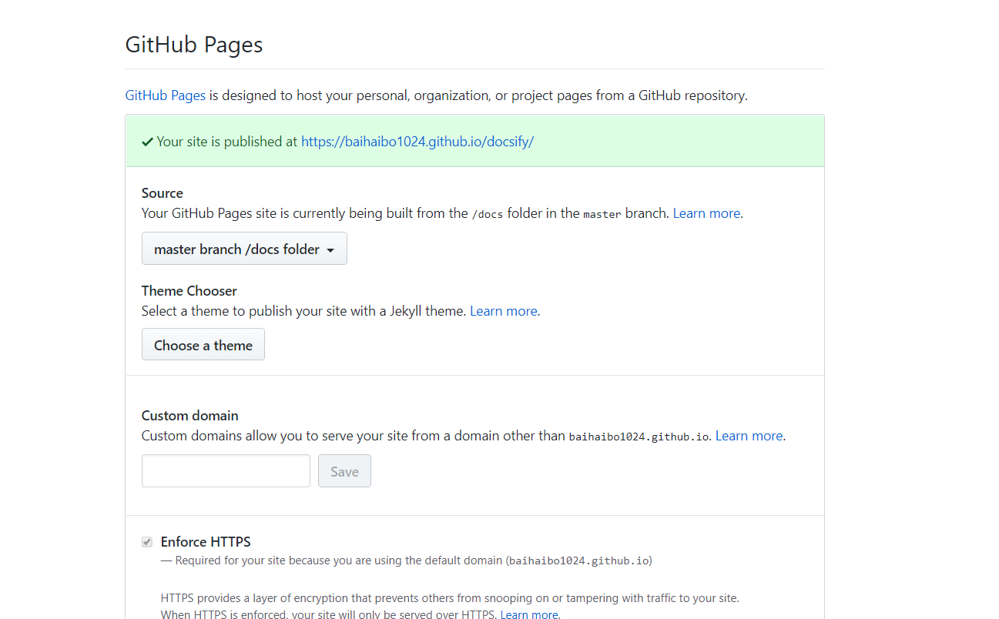

## 一、要有git环境，有github账号

windows下安装git

因为要使用Github Pages来部署，先注册github的账号。

## 二、有node环境

docsify框架需要有node环境的支持。上node.js的官网下载安装包安装即可。另外需要配置下环境变量。

## 三、使用docsify命令生成文档站点

### docsify中文官网: https://docsify.js.org/#/zh-cn/
#### 1.安装docsify-cli 工具

```
npm i docsify-cli -g
```

因为我们已经安装了node环境，所以直接打开CMD窗口执行上面的命令

#### 2.初始化一个项目

**选择一个目录，作为我们的博客站点目录。也就是项目要生成的目录**

比如我在E盘下新建了一个blogs的目录

 **打开CMD，cd到该目录，执行如下命令：**

```
docsify init ./docs
```

执行完成后，多了一个docs文件夹，其实这个文件夹就是将来我们存放MD格式的博客文件的地方。

与此同时，docs目录下会生成几个文件:

- index.html 入口文件
- README.md 会做为主页内容渲染
- .nojekyll 用于阻止 GitHub Pages 会忽略掉下划线开头的文件

## 四、部署到Github上

#### 1.登录github账号，创建仓库

创建一个仓库，起个名字叫blogs(随意)。

#### 2.创建本地仓库，推送到github

首先我们进入我们的本地博客站点目录，也就是 `E:\blogs`

右键 `GitBashHere` 打开git命令行初始化一个仓库，并提交所有的博客文件到git本地仓库。

**命令如下：**

1. `git init // 初始化一个仓库`
2. `git add -A // 添加所有文件到暂存区，也就是交给git管理`
3. `git commit -m "myblogs first commit" // 提交到git仓库，-m后面是注释`
4. `git remote add origin https://github.com/**/blogs.git`
5. `git push -u origin master // 推送到远程 blogs仓库`

我们的本地 blogs已经同步到了github上面了。

#### 3.使用Github Pages功能建立站点

在blogs仓库下，选中 `Settings` 选项，找到`GitHubPages` ，在Source下面选择 `master branch/docs folder` 选项。



同时，还会提示你在哪里去访问你的站点。
